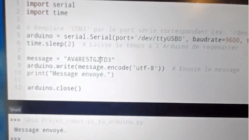
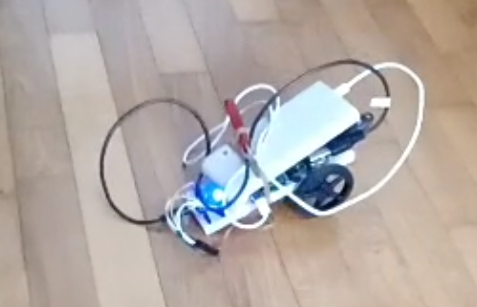
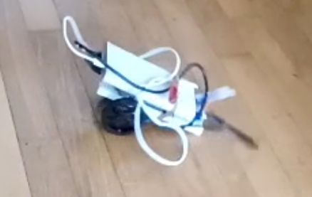

# 🤖 Two-Wheel Robot Controlled by Chatbot


  

  
  

<p align="center">
  
</p>

## 📝 Project Description  
This project is a **two-wheel robot**🛞🛞 controlled by a **chatbot interface**🤖💬.  
The flow is simple:  

1. 🖥️ **PC** → A chatbot interprets user commands in natural language and translates them into robot instructions (i.e."AV4" or "TG2").  
2. 🍓 **Raspberry Pi 4** → Forwards the instructions (through Wifi) to the Arduino over serial.  
3. 🔌 **Arduino DUE Nano** → Controls two FS90R continuous servos (left & right wheels) and executes commands (move forward, backward, turn).  
4. 🚦 LEDs indicate status:  
   - 🟥 Red = error / unknown command  
   - 🟩 Green = turning  
   - 🟨 Yellow = moving forward/backward  

---

## ⚙️ Features
- 💬 **Natural language control** via chatbot (e.g. *"Turn left 90° then move forward 10cm"*)  
- 🛠️ **Command translation** into robot actions:  
  - `AVx` → move forward (10cm × x)  
  - `REx` → move backward (10cm × x)  
  - `TGx` → turn left (10° × x)  
  - `TDx` → turn right (10° × x)  
  - `NRF` → do nothing  
- 🔄 Serial communication between PC → Raspberry Pi → Arduino  
- ⚡ LED status feedback  
- 🏎️ Smooth movement with continuous servos

**The project is not finished!** The easy ssh part for transporting commands through Wifi is not done. I didn't finish it because it's easy but takes time. Starting a new and challenging project is what I prefer to do instead of wasting time on it!

---

## 🎮 Example Screenshots  
Here’s what is look: (Sorry for the bad quality, I have an old phone. Now, I reuse the componants for other projects 😉)  

<p align="center">
  
  
</p>

The white thing is the **battery** (Normaly for a phone but here, it's for the Raspberry and the Arduino).

---

## 📂 Repository structure
```bash
├── Part LLM/                          # On PC
│   └── main.py                        # Python script translating the natural instructions into commands
│
├── Part_Raspberry/
│   └── Projet_robot-pi_to_arduino.py  # Raspberry Pi script sending commands to Arduino
│
├── Part Arduino Nano/
│   └── main.cpp                       # Arduino code for motor + LED control
│
├── Part Arduino Nano/                 # Images for the README
│
├── LICENSE
└── README.md
```


---

## 📖 Inspiration / Sources  
After **receiving a raspberry**, I started thinking about using it with my **AI passion**! I also wanted to apply AI in real life.

😆 100% coded by myself, no tutorials (just for the purpose of simplifying how to use a Raspberry Pi 4 and connect it to my PC).

Code created by me 😎, Thibault GAREL - [Github](https://github.com/Thibault-GAREL)
